## VPC와 서브넷 관계 추가

### 인터넷
- 엄청나게 넓은 도시

### AWS
- 도시 안에 있는 거대한 빌딩 단지

### VPC (Virtual Private Cloud)
- 단지 안에서 내가 담장을 치고 내 공간을 확보한 것 = 아마존 클라우드 안에 내가 만든 나만의 사무용 건물
- 내 건물이니까 마음대로 규칙 추가 가능 (Ex. 방화벽 규칙, IP 주소 범위)

### 서브넷
- 건물 안에 있는 여러개의 방
- **퍼블릭 서브넷** (공개 구역)
  - 건물의 1층 카페 홀 (외부에 보여줘야 하는 것들 / 인터넷에서 직접 접근 가능)
- **프라이빗 서브넷** (비공개 구역)
  - 카페의 주방 (직원만 들어갈 수 있는 곳 / 인터넷에서 직접 접근 불가능)

### 인터넷 게이트웨이 (IGW)
- VPC와 인터넷 사이의 **정문** 역할
- IGW가 없으면 외부에서 아무도 들어올 수 없고, 내부에서도 인터넷에 나갈 수 없음

### 라우팅 테이블
- 아파트 단지 안내판 (패킷 - 데이터 조각 이 VPC 안에서 이동할때 어디로 가야할지를 알려주는 안내판)
- 퍼블릭 서브넷 안내판
  - 단지 내부 주소(10.0.0.0/16)로 가? → 그냥 단지 안에서 찾아가
  - 그 외 모든 주소(0.0.0.0/0)로 가? → 정문(IGW)으로 나가
- 프라이빗 서브넷 안내판
- 단지 내부 주소로 가? → 단지 안에서 찾아가
- 그 외 주소로 가? → NAT 게이트웨이 통해서 나가 (직접 나가는 문은 없음!)

### NAT 게이트웨이
- 마치 직원이 외부 심부름을 대신 해주는 것 (프라이빗 서브넷은 외부에서 직접 들어올 수가 없으니까)

## CIDR 이란

- IP 주소 범위를 표현하는 방법 ( = 몇번지부터 몇번지까지를 짧게 쓰는 표기법)
- **서브넷의 CIDR은 반드시 VPC CIDR안에 포함되어야함!**
  - 단지 안에 동을 만드는 개념이니까
- IP 주소는 총 32개의 비트(0 또는 1)로 이루어져 있음
  - 슬래시 뒤 숫자는 **앞에서부터 몇 개를 고정(잠금)할 건지**를 의미
  - ex. 10.0.0.0/16 <-"10.0 까지는 고정이고, 나머지 두 자리는 마음대로 써도 되는 범위"

## AWS 네트워크 환경 구축하기
