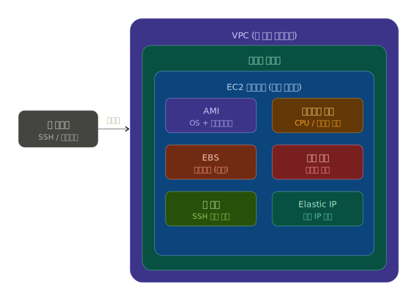

## CH 03. IAM 사용자 추가 설명

### IAM 관련 개념
#### 사용자 (User)
- AWS를 사용하는 개별 사람이나 프로그램
- ex. 김개발이라는 사람에게 AWS 출입증을 하나 발급해주는 것

#### 그룹 (Group)
- 사용자들을 묶은 부서
- ex. 개발팀 그룹에 "EC2 접근 허용" 정책을 붙이면, 그 팀 모든 사람이 자동으로 EC2를 쓸 수 있음 -> 사람마다 일일이 설정 안해도 됨

#### 정책 (Policy)
- 출입 규칙표
- ex. "S3는 읽기만 가능, EC2는 생성도 가능" 같은 규칙을 JSON으로 적어둔 문서

### 접근 방법 2가지
#### 콘솔 로그인
- 브라우저에서 console.aws.amazon.com에 접속해서 계정 ID, 사용자 이름, 비밀번호를 입력하는 방식
- 사람이 직접 AWS를 조작할때 사용

#### 엑세스 키
- 프로그램이나 CLI(명령어 도구)가 AWS에 접근할 때 쓰는 열
- Access Key ID와 Secret Access key 2개가 한쌍으로 발급
  - 코드 안에 넣거나 터미널에 설정하면 프로그램이 자동으로 AWS 사용 가능

## CH 04. EC2
### 아마존 EC2 란?

- EC2 = 아마존이 빌려주는 가상 컴퓨터
- **VPC (가상 네트워크)** 안에 **서브넷** (나눠진 구역)이 있고, 그 안에 **EC2 인스턴스** (실제 서버) 존재
  - EC2 안에 AMI (OS 이미지), EBS (저장공간), 보안 그룹 (방화벽), IAM (접근 권한) 등이 있는 것