## 03. AWS 기본 서비스 이해하기

### AWS I AM
- Identity and Access Management
- AWS 권한 관리 (AWS 계정 내에서 각 사용자, 그룹 또는 리소스에 대한 권한을 중앙 집중적으로 관리)
  - AWS 리소스에 대한 엑세스를 제어하고 각 사용자에게 필요한 작업만 수행할 수 있는 권한을 부여

### AWS 사용자의 종류
#### 루트 사용자
- 모든 사용자의 최상위 계층에 있으며 관리자 권한을 가지고 있음
- AWS의 모든 작업을 수행 가능

#### IAM 사용자
- 루트 사용자의 최소환의 권한만을 부여받아 특정 리소스에 접근할 수 있음 (보안 때문)
-  **실무에서는 루트로 로그인하는 것은 거의 X, IAM 사용자를 따로 만들어서 씀**

## AWS CLI 란
- 명령어를 타이핑해서 AWS를 조종하는 방법
  - cf. 브라우저로 접속한 AWS 콘솔과 동일
- aws ec2 describe-instances

### MFA (Multi-Factor Authentication)
- 다중 인증

## 04. 가상 클라우드 서버 파악하기

### AMI (Amazon Machine Image)
- 서버를 통째로 복사해둔 사진 (이미 다 필요한게 설치된 상태를 통째로 저장해둔 것)
- AMI 1개 안에는 **운영체제(OS), 그 위에 설치된 소프트웨어들, 각종 설정값들** 담겨 있음
- ex. 웹 서버 10대를 새로 켜야하는 상태
  - if) AMI가 없다면, 10대를 하나하나 세팅해야함
  - AMI가 있다면, 서버 1대 세팅 -> AMI로 저장 -> 해당 AMI를 사용해서 나머지 9대 복사 생성

### 아마존 EC2 스토리지 옵션

- **EC2 스토리지** : 서버의 저장공간

#### EBS
- 외장 하드
- EC2를 쓸때 기본으로 붙는 스토리지
  - ex. 노트북(EC2)에 꽂아서 쓰다가, 노트북을 꺼도 외장 하드 안에 데이터는 그대로 유지되는 것과 유사 / 다른 노트북에 꽂아서 사용도 가능

#### 인스턴스 스토어
- 노트북 내장 SSD
- 임시 데이터, 캐시 같은 것들에 주로 사용 (잠깐 쓰고 버려도 되는 것들)
- 속도 가장 빠름 BUT 데이터 관리 주의 필요
  - ex. 노트북이 고장나거나 꺼지면 데이터가 날라감

#### S3 (추가)
- 구글 드라이브 같은 인터넷 창고
- EC2 서버 안에 있는 것이 아니라 완전히 별도로 존재
- 용량 제한이 없고, 어디서든 접근 가능
  - ex. 사진, 영상, 로그 파일처럼 많은 양의 파일을 저장할때 씀

#### 실제 실무에서 사용 방식
EC2 서버 내에 3가지를 아래와 같이 조합해서 주로 사용한다.
- **EBS** : OS + 애플리케이션 설치
- **인스턴스 스토어** : 임시 처리 데이터 (캐시)
- **S3 연동** : 업로드된 이미지, 로그 파일 보관

## 05. 관계형 데이터베이스 서비스 파악하기

### 아마존 RDS
- AWS에서 관계형 데이터베이스를 제공하는 서비스
- = RDS = RDS 인스턴스 = DB 인스턴스

**RDS 인스턴스 하나를 만들 때 선택하는 것들**  
├── 엔진 유형    → MySQL? PostgreSQL? Aurora?  
├── 인스턴스 클래스 → 사양은 어느 정도?  
├── 스토리지 유형  → 속도 vs 비용 어느 쪽 중요?  
└── DB 그룹      → 어디에 배치하고 어떻게 설정?  

#### 관계형 DB
- 태아불 형태로 데이터 저장하고, 테이블끼리 연결해서 사용하는 방식

### 아마존 RDS 엔진 유형 ( = DB의 종류)
| 엔진 | 특징 |
| --- | --- |
| MySQL | 가장 대중적, 무료 오픈소스 |
| PostgreSQL | 기능 풍부, 복잡한 쿼리에 강함 |
| MariaDB | MySQL 기반, 더 가볍고 빠름 |
| Oracle | 대기업에서 많이 씀, 유료 |
| SQL Server | 마이크로소프트 제품, 윈도우 환경 |
| Aurora | AWS가 직접 만든 엔진, 위 것들보다 3~5배 빠름 |

### 아마존 RDS 스토리지 유형
| 유형 | 특징 |
| --- | --- |
| 범용 SSD (gp2/gp3) | 가장 대중적 |
| 프로비저닝된 IOPS (io1) | 빠른 속도 / 응답 속도가 중요한 금융권쪽에서 주로 사용 / 비쌈 |
| 마그네틱 | 구형 / 느리고 저렴 |

### 아마존 DB 그룹
- RDS를 구성할떄 쓰는 설정 묶음

| **유형** | **역할** | **특징** | **비유** |
| --- | --- | --- | --- |
| **서브넷그룹** | 어디에 배치할지 | 서브넷의 집합 해당 그룹에 속한 서브넷에 RDS 생성 | 건물 몇 층에 입점 |
| **파라미터그룹** | DB 내부 설정 값 | DB 엔진 파라미터 집합 (예: `time_zone = Asia/Seoul`) | 카페 운영 내부 규칙 |
| **옵션그룹** | 추가 기능 붙이기 | 연결된 DB의 스냅샷 관리 | 카페 부가 서비스 추가 |

### 확장성 && 고가용성을 위한 옵션들

#### 읽기 전용 복제본 (Read Replica)
- db의 부하 분산을 위해 생성된 복제본
- 읽기, 검색만 수행 가능 (해당 작업을 복제본에서 수행함으로써 마스터 디비의 부하 분산)

#### 다중 AZ (Multi Availabilty Zone)

- **다중 AZ** : 혹시 모를 사고를 대비한 예비 DB
  - AZ (Availability Zone (가용 영역))
  - = 데이터센터 건물
- 특징
  - 평소에는 **Primary**만 사용
    - Standby는 쿼리를 받지 않고 그냥 동기화만 진행
    - 읽기 부하를 나눠서 처리하고 싶다면 AZ가 아니라 읽기 전용 복제본 사용 필요
  - 장애 발생 시 자동으로 전환
    - **Failover** 동작 실행
    - AWS가 알아서 1-2분 내에 Standby를 Primary로 승격
  - 데이터 손실이 없음
    - 실시간으로 동기화되고 있기에 AZ 1개가 터져도 다른 AZ에 동일한 데이터가 존재하기 떄문

