## CloudFront 캐시 무효화 (Invalidation)
### 문제 상황
- 새 버전을 배포하였지만 사용자에게 이전 화면이 그대로 보이는 경우
- TTL이 끝나야 CloudFront가 새 파일을 가져오기 때문

### 해결 방법 : 캐시 강제 초기화
#### 1. 새 파일을 S3에 업로드하기
#### 2. CloudFront Invalidation 실행
- /* 경로로 전체 무효화를 진행하거나 또는 특정 파일이 지정해서 진행 가능
#### 3. 다음 요청부터 새로운 파일로 제공
- 엣지 로케이션이 새 파일로 갱신됨

## AWS 프론트엔드 배포 흐름 
사용자 브라우저 -> Route 53 (도메인을 IP로 변경) -> CloudFront (캐시 + CDN + HTTPS) -> S3 (빌드 파일 저장)

- 사용자가 브라우저에 주소를 입력하는 경우 아래와 같이 동작

- 2번 콘텐츠 전달 부분에서 캐시를 확인해서 S3 방문 여부를 결정

- CloudFront는 전 세계 곳곳에 엣지 서버를 두고, 파일을 TTL동안 캐시
  - 캐시 히트 시, S3까지 안가도 되니까 응답이 훨씬 빠름
    - 해당 동작을 위해, 새 배포 후 캐시 무효화를 해줘야하는 것