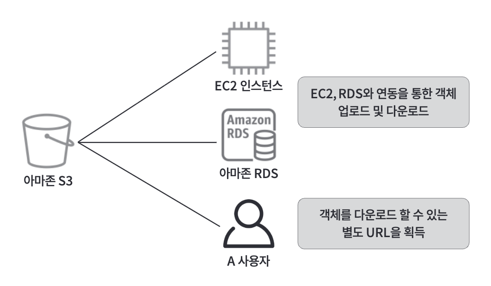
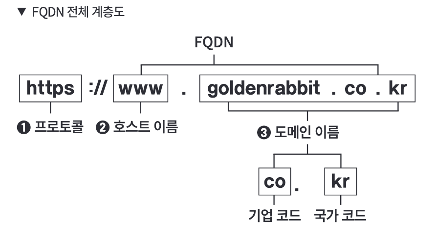
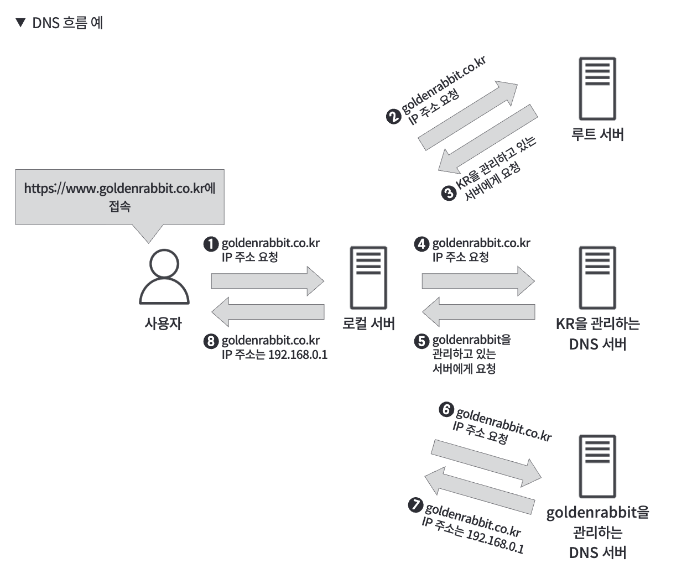
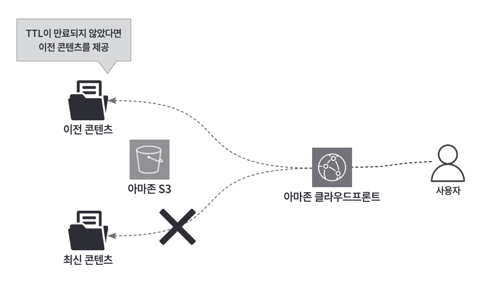

## 06. 객체 스토리지 서비스 파악하기

### 아마존 S3 - 객체 스토리지 서비스

#### 객체
- 일정한 형태나 형식, 틀이 정해지지 않은 비정형 형식의 데이터

#### S3
- 비정형 데이터 (=객체)를 저장 및 관리하는 서비스
- **버킷** 이라는 스토리지에 객체를 저장
  - 모든 리전에서 항상 고유한 이름을 가짐
  - 객체는 버킷 내부에서 고유한 키를 가지며, 동일 이름의 키 객체를 저장하면 덮어쓰기가 일어남

#### S3 저장된 객체 활용 방법

- S3 버킷 (중앙 초록): 모든 연동의 허브
- EC2 / RDS (보라): 양방향 데이터 주고받기 — 로그, 백업, 스냅샷
- CloudFront / Lambda (노란): 정적 파일 CDN 배포, 파일 업로드 이벤트 트리거
- Presigned URL 흐름 (하단 점선): ① 서버 요청 → ② S3 URL 생성 → ③ 사용자 전달 → ④ 직접 다운로드

### S3 스토리지 클래스
- "데이터를 얼마나 자주 꺼내 쓰는가"에 따라 비용과 성능을 다르게 선택할 수 있는 저장 등급
- 객체에 대한 엑세스 빈도가 높을수록 -> 요청 수 증가 -> 비용 증가
  - 객체의 get, put, post, list, copy 등의 요청 수에 따른 요금이 발생

### 객체 관리
#### 1. 버저닝
#### 2. 생명주기 규칙 활용
- 객체를 생성한 날부터 지정한 기간이 경과한 객체를 자동 삭제 (보존 기간 설정)

## 07. 프론트엔드를 위한 서비스 이해하기

### 아마존 라우트53
- AWS의 클라우드 DNS 웹 서비스 (DNS 서비스 도메인 이름을 IP 주소로 변환해주는 역할)
- 도메인을 구매하고, AWS에서 구축한 웹 서버와 연결하여 효율적으로 트래픽 전달 가능
- 사용자가 브라우저에 주소를 입력하면 라우트53이 해당 서버의 IP를 찾아줌

#### FQDN (Fully Qualified Domain Name)

- 웹 서버 호스트 이름과 도메인 이름을 포함한 전체 이름을 의미
- **도메인** : 문자열로 IP 주소를 대체
  - **메인 도메인** : ex. goldenrabbit.co.kr
  - **서브 도메인** : ex. blog.goldenrabbit.co.kr, shop.goldenrabbit.co.kr
- **호스트** : www 부분이 해당
  - 인터넷에 공개된 웹페이지를 연결시키는 구조를 의미
  - 웹페이지에 필요한 HTML 기술이나 전송에 필요한 HTTP 프로토콜이 사용

#### DNS (Domain Name System)
- IP 주소와 도메인 이름을 변환하는 역할 수행
  - DNS 서버에서 도메인을 관리
  - 사용자가 도메인을 입력하면 DNS 서버에서는 해당 도메인을 IP 주소로 변환하고 관리 (=이름 해결)
  - 반환된 IP 주소를 바탕으로 웹 사이트에 접근
- 계츨적으로 구성되어 있으며, 전 세계에는 수많은 DNS 서버가 계층적으로 연결되어 있음

#### 호스팅 영역 (Hosted Zone)
- 도메인을 관리하는 호스팅 영역에 저장된 도메인을 활용
  - 웹 사이트로 사용할 서버에 도메인 할당 / 하위 도메인 생성 등 작업 수행
- **퍼블릭 호스팅 영역**
  - 공개 도메인을 사용해 웹사이트를 호스팅
  - 인터넷 통해 접근 가능
- **프라이빗 호스팅 영역**
  - 사내 네트워크에서만 접근 가능
  - VPC 내부에서만 유효

#### 장애 조치 라우팅 정책 (Failover Routing Policy)
- 트래칙을 분산시킬 수 있는 트래픽 라우팅 정책들 중 하나
- 메인 서버에서 문제가 발생할 경우 자동으로 하위 서버로 트래픽을 전환할 수 있는 정책
- 사용자에게 끊김 없는 서비스를 제공

## 08. 콘텐츠 전송을 위한 프론트 서비스 파악하기

### 아마존 클라우드프론트
- 사용자에게 동영상, 이미지와 같은 정적 콘텐츠를 사용자에게 빠르고 안전하게 배포하는 CDN (Content Delivery Network)
- 캐시 서버가 있으므로 사용자는 오리진 서버 (EC2 인스턴스)에 직접 접근 필요 X
  - 캐시 서버에 있는 데이터를 바탕으로 사용자의 위치에서 가장 가까운 에지 로케이션에서 콘텐츠를 안전하고 빠르게 전송 가능
- 아마존 S3만 사용할때보다, 아마존 클라우드프론트를 연동하면 콘텐츠 전송 속도가 더 빠름

### 아마존 클라우드프론트 구성 옵션
#### 1. 오리진 도메인
- 사용자에게 제공할 콘텐츠의 리소스 (웹 서버 등의 콘텐츠 제공자가 위치한 서버)
- ex. 아마존 S3 (아마존 클라우드프론트 연동의 경우에서 사용자에게 콘텐츠를 제공하니까)

#### 2. 오리진 경로와 오리진 엑세스
- 아마존 클라우드프론트 생성 -> 배포 도메인 이름 생성 -> 사용자는 해당 도메인 이름을 통해 콘텐츠 접근
- [배포 도메인 이름] + [파일] 형식
  - Ex. https://xxxx.cloudfront.net/파일

- **OAI** (Origin Access Identity = 원본 접근 ID)
  - 아마존 클라우드프론트의 에지 로케이션과 오리진 서버 사이의 인증을 관리
    - 외부로부터 S3 버킷에 대한 직접적인 접근을 금지하고, 아마존 클라우드프론트를 통해서만 접근할 수 있도록 설정 가능
  - 콘텐츠에 대한 보안 강화 가능
- **OAC** (Origin Access control)
  - CloudFrint(퍼블릭 엔드포인트)에서 OAC를 통해 비공개 S3 버킷으로 이동 가능
  - 더 강화된 보안 기능을 제공
  - OAI에서 OAC 사용으로 변경할 것을 권장

#### 3. 도메인 설정
- 아마존 라우트53을 사용해서 사용자 정의 도메인을 클라우드프론트 배포에 연결 가능
  - 사용자가 자신의 도메인을 사용하여 아마존 클라우드프론트를 통해 콘텐츠를 제공받을 수 있음

#### 4. 캐시 정책
- TTL, 헤더, 쿼리 문자열, 쿠키를 설정 가능
  - **TTL** : 아마존 클라우드프론트가 콘텐츠를 캐시하는 시간
    - 길게 설정하면, 
      - 사용자가 콘텐츠에 대한 요청을 할때 아마존 클라우드프론트가 로컬 캐시에서 해당 콘텐츠를 찾을 가능성이 높아짐 -> 웹사이트 성능 향상 가능
      - BUT 사용자에게 새로운 콘텐츠가 제공되지 X고 이전 콘텐츠가 제공될 가능성 있음
    

- **캐시 히트 비율**
  - 아마존 클라우드프론트가 캐시한 파일을 사용자에게 반환하면 캐시 적중률 상승
  - 사용자가 요청한 파일이 없으면, 오리진 서버에 파일을 요청하므로 캐시 적중률 하락
