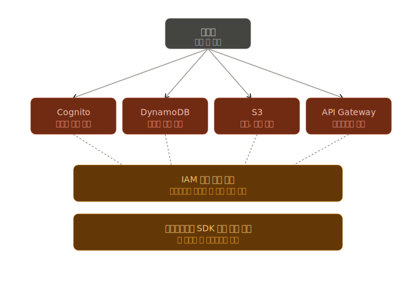
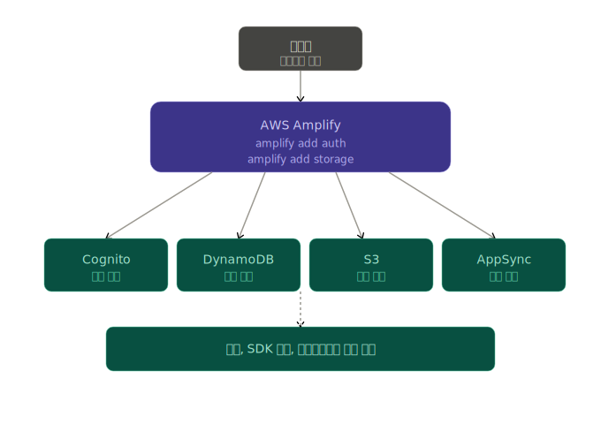

## 어느 경우에 AWS 앰플리파이를 사용하는 것이 좋은가? (예시)

### 시나리오 : "독서 기록 SNS" 앱을 혼자 만든다고 가정
읽은 책에 별점과 후기를 남기고, 다른 사용자와 공유하는 모바일/웹 앱. 다음 기능이 필요

- 회원가입/로그인 (구글 로그인 포함)
- 책 표지 사진 업로드
- 후기 데이터 저장
- 다른 사용자 후기 조회

### 방법 1: Amplify 없이 직접 구축하는 경우

- AWS 콘솔에서 각 서비스를 따로따로 만들고
- 권한을 일일이 연결하고
- 프론트엔드에서 각 서비스에 접속하는 코드를 직접 짜야함

### 방법 2: Amplify를 사용하는 경우

- 개발자가 터미널에서 amplify add auth 라고 치면 "구글 로그인 쓸래? 페이스북?" 등 물어보고 알아서 구축

### 비유: 가구 조립

| 구분 | Amplify 없이 | Amplify 사용 |
| --- | --- | --- |
| 비유 | 목재, 나사, 경첩 따로 사서 직접 조립 | 이케아 가구 조립 |
| 인증 기능 | Cognito 콘솔에서 사용자 풀 생성, 클라이언트 ID 복사, 토큰 검증 코드 직접 작성 (수 시간) | `amplify add auth` 한 줄 (약 2분) |
| 이미지 업로드 | S3 버킷 생성, CORS 설정, 업로드 권한 정책 작성, presigned URL 코드 작성 | `amplify add storage` 한 줄 |
| 개발 환경 분리 | dev/prod 환경을 각각 수동 복제 | `amplify env add` 한 줄 |
| 배포 | 빌드 → S3 업로드 → CloudFront 캐시 무효화 수동 작업 | Git push만 하면 자동 배포 |

### 사용하게 되는 케이스
- 스타트업 MVP 만드는 경우
- 프론트엔드가 백엔드까지 책임져야하는 경우

### 근데 왜 회사에서는 많이 안쓸까?
#### 1. 회사가 커지고 요구사항이 복잡해지면 추상화가 오히려 방해됨
  - Ex. "DynamoDB 인덱스를 이렇게 바꾸고 싶어" → Amplify CLI로는 불가능, 직접 건드리면 다음 배포 때 덮어써짐

#### 2. 블랙 박스 문제 - 장애가 발생 시 파악이 어려움
  - 내부적으로 CloudFormation, Lambda, IAM 정책 등을 자동 생성하니까, 문제가 생겨서 디버깅시 모든 AWS 서비스를 다 알아야하는 이슈

#### 3. 커스터마이징의 한계
  - Ex. "특정 국가 사용자만 다른 인증 방식 써야 함" 이런거 불가

   
   

## Amazon Cognito의 단점
#### 1. UI가 불편하고 못생김
- 제공하는 기본 로그인 화면이 불편하고 못생겨서, 대부분 직접 UI를 만들고 Cognito는 백엔드로만 사용
#### 2. 한국어 메시지 커스터마이징이 까다로움
#### 3. 한번 만들면 마이그레이션이 어려움
- 비밀번호가 해시되어 있어서 사용자 데이터를 다른 서비스로 옮기기 어려움
#### 4. 가격이 사용자 수에 비례
- 월 활성 사용자(MAU) 기반 과금이어서, 사용자가 많아지면 비용이 비싸짐

   
   

## ELB가 하는 기능
#### 1. 장애 격리 — 죽은 서버는 빼고 보냄
- 헬스 페크를 계속 해서, 답이 없으면 해당 서버를 자동으로 제거하고 트래픽을 살아있는 서버에만 보냄

#### 2. 무중단 배포 가능
- 새 버전을 배포할 때:
  - 옛날: 서버 끄고 → 새 코드 올리고 → 다시 켬 → 그 동안 서비스 다운
  - 로드 밸런서 사용: 서버를 한 대씩 빼서 업데이트하고 다시 넣음 → 사용자는 모름

#### 3. SSL/HTTPS 처리 위임
- 각 서버마다 SSL 인증서를 설치하지 않아도 됨
- 로드 밸런서가 HTTPS를 처리하고, 뒤쪽 서버와는 일반 HTTP로 통신
  - 인증서 갱신 같은 귀찮은 일도 ELB가 알아서 함

#### 4. 자동 확장(Auto Scaling)과 연동
- 트래픽 폭증 시: (Ex. 블프)
  - 로드 밸런서가 트래픽 양 감지
  - AWS가 새 서버를 자동으로 띄움
  - 새 서버를 로드 밸런서에 자동 등록
  - 트래픽이 자연스럽게 분산됨

