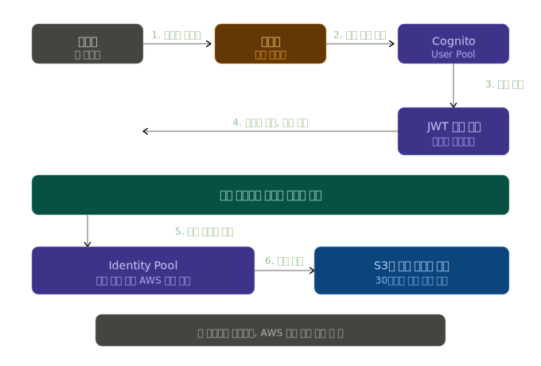
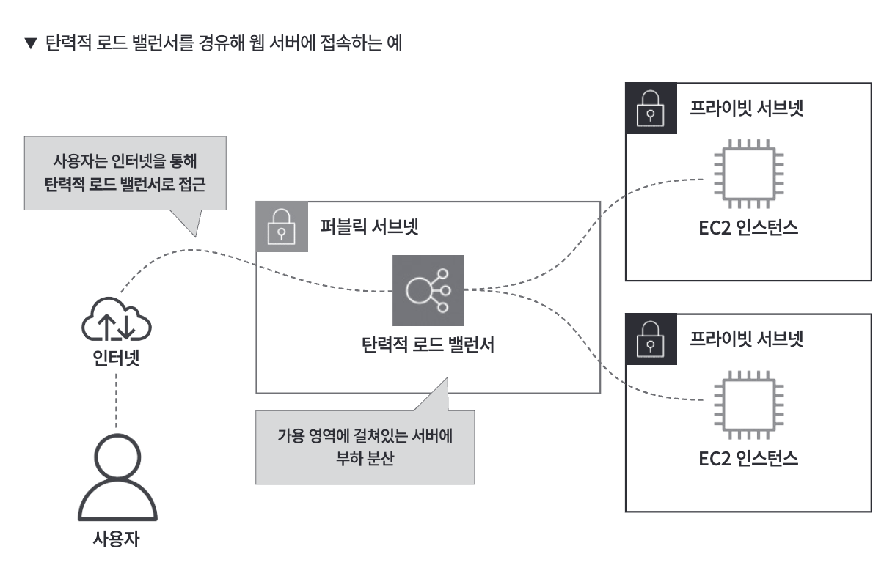
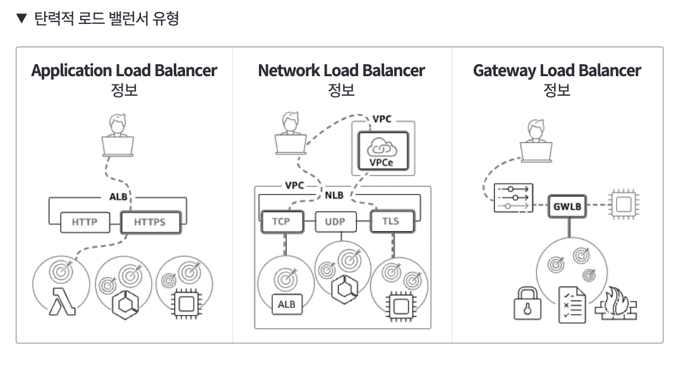
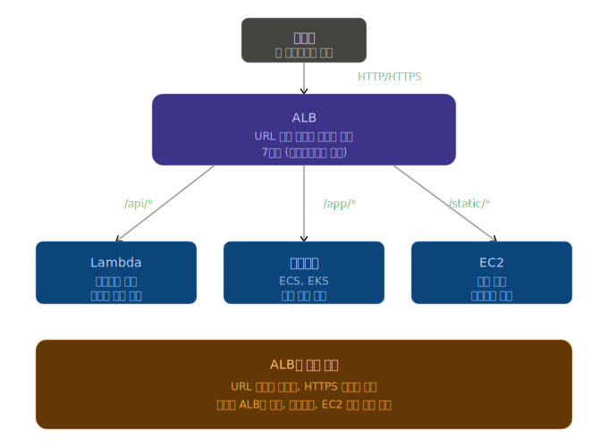

## 09. 웹 애플리케이션 배포용 프론트 서비스 파악하기

### AWS 앰플리파이 (Amplify)
-  AWS에서 모바일 및 웹 애플리케이션 개발을 가속화하기 위한 도구 세트(오픈 소스 프레임워크, 비주얼 개발 환경, 콘솔) 및 서비스(웹 앱, 정적 웹사이트 호스팅)로 구성된 플랫폼

#### 앰플리파이 스튜디오
- 프론트엔드를 포함해 웹 애플리케이션을 간편하게 호스팅할 수 있는 기능
- 관리 콘솔 화면에서 코드 없이 시각적으로 앱의 프론트/백엔드를 구성할 수 있는 비주얼 개발 환경
- 스튜디오에서 정의한 데이터는 아마존 다이나모DB에서만 관리 가능해서 다른 DB 서비스 이용 불가 (ex. 아마존 RDS)

#### 앰플리파이 호스팅
- 프론트엔드와 백엔드 개발용 UI 편집기로 피그마와 연동할 수 있는 기능
- 정적 웹 애플리케이션을 호스팅하는 기능
  - ex. 정적 웹페이지, 리랙트, Vue.js 등의 js 프레임워크로 작성된 웹 애플리케이션을 쉽게 배포 및 관리 가능

### AWS 앰플리파이에서 사용 가능한 도구들
#### 관리 콘솔 환경
- 편리한 UI를 제공해서 쉽게 웹 애플리케이션 구축/호스팅 가능

#### AWS 앰플리파이 CLI
- 명령줄을 통해 프로젝트를 설정하고 관리할 수 있음

#### AWS 앰플리파이 UI
- 개발용 UI 라이브러리 : 다양한 템플릿과 컴포넌트 제공

## 10. 사용자 인증을 위한 프론트 서비스 파악하기

### Amazon Cognito (아마존 코그니토)
- AWS에서 사용자 관리와 인증 기능을 제공하는 서비스
  - 개발자가 회원 관리 서비스 안 만들고, Cognito에서 외주 맡긴다! 라고 이해하면 편함
  - 회원가입/로그인의 모든 복잡한 부분을 대신 처리
  - 소셜 로그인을 쉽게 연동 가능
  - 로그인한 사용자에게 AWS 서비스 사용 권한도 안전하게 발급
  - AWS 다른 서비스(S3, Lambda 등)와 자연스럽게 연결

### Cognito의 2가지 기능

#### 1. USer Pool (사용자 풀) - "회원 데이터베이스"
- "누가 우리 서비스 회원인가?" 를 관리하는 부분
  - 사용자 관리와 인증을 담당
- ex. 어떠한 방식으로 로그인을 진행할지 설정

#### 2. Identity Pool (자격 증명 풀) — "AWS 출입증 발급기"
- 로그인한 사용자에게 AWS 서비스 사용 권한을 임시로 발급해주는 것

- 실제 사용 흐름 - 카카오 로그인 예시
  
  - 사용자는 카카오로 로그인만 하였지만, 결과적으로 S3 업로그 권한을 부여받아서, AWS 안의 자기 폴더에 사진을 업로드 할 수 있게 되는 것

## 11. 백엔드 서비스 이해하기

### 탄력적 로드 밸런서 (부하 분산 서비스 = 트래픽 분배자)

- 웹 서버 앞(퍼블릭 서브넷)에 배치 + 사용자는 탄력적 로드 밸런서를 경유하여 웹 사이트로 접근
- 사용자가 급증하더라도 적절하게 트래칙을 부하 분산 가능 -> 안정적으로 서버 운영 가능
  - 프라이빗 서브넷에 있는 EC2 인스턴스로 부하 분산을 시도
  - 여러 가용 영역에 걸쳐 부하 분산을 실시할 수 있기 때문에 하나가 무너져도, 다른 가용 영역에서 서비스 지속 가능

### 3가지 종류

#### 1. ALB (Application Load Balancer)

- **비유: 백화점 안내 데스크**
  - 백화점의 안내 데스크에서는 "여성복은 3층, 식당가는 8층, 화장실은 1층"이라고 알려줌. ALB가 딱 그 역할을 수행
    - 사용자가 shop.com/products로 들어오면 → "상품 서버로 가세요"
    - 사용자가 shop.com/login으로 들어오면 → "로그인 서버로 가세요"
- URL을 읽어서 적절한 곳으로 보내주는 역할
- OSI 7