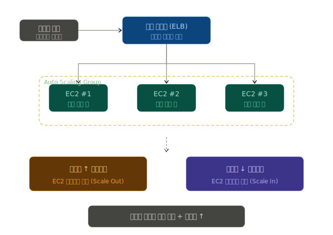

## 오토 스케일링 && 로드 밸런서 활용

로드 밸런서 = 분산, 오토 스케일링 = 증감. 합치면 = 트래픽이 어떻게 변하든 알아서 버티는 시스템.

### 로드 밸런서 (Load Balancer) = "교통 정리원"
- 사용자가 한 곳(예: myshop.com)으로 요청을 보내면, 뒤에서 여러 대의 서버(EC2 인스턴스)가 일하고 있음 
- 로드 밸런서는 이 요청들을 한 서버에 몰리지 않게 골고루 나눠주는 역할 수행 
  - 한 서버가 죽어도 살아있는 다른 서버로 요청을 보내주기 때문에 서비스가 끊기지 X 
  - AWS에서는 이걸 ELB (Elastic Load Balancer)라고 부르고, 웹 트래픽엔 보통 ALB (Application Load Balancer)를 사용

### 오토 스케일링 (Auto Scaling) = "자동 채용/해고 시스템"
- 평소엔 EC2 2~3대로 충분하다가 갑자기 트래픽이 폭증하면(세일 이벤트, TV 광고 직후 등) 자동으로 EC2를 더 만들어서 투입 
- 트래픽이 가라앉으면 다시 자동으로 줄임 
- 기준은 보통 CPU 사용률 같은 지표 (예: "CPU 70% 넘으면 1대 추가")

### 같이 쓰는 이유
- 오토 스케일링이 새 EC2를 만들어도 누군가는 "얘한테도 요청 보내줘"라고 등록해줘야 함 <- 그 역할을 로드 밸런서가 진행하는 것 
  - 새로 생긴 EC2가 자동으로 LB 뒤에 붙고, 사라지는 EC2는 LB가 더 이상 요청을 안 보냄
  - 그래서 로드밸런서와 오토 스케일링은 거의 항상 세트로 등장

