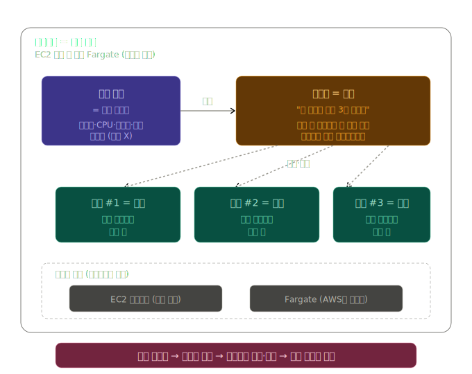
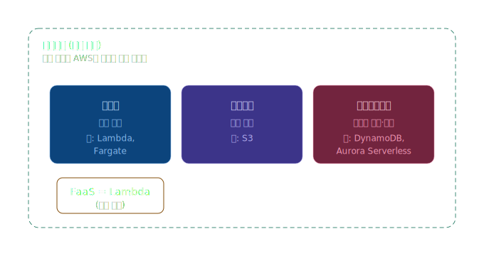
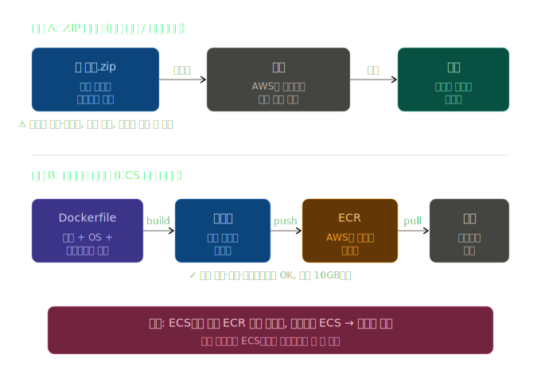

## 12. 클라우드 서버 최적화를 위한 백엔드 서비스 파악하기

### 아마존 EC2 오토스케일링
- 오토스케일링 그룹을 생성하여 EC2 인스턴스에 대한 스케일업, 스케일아웃, 스케일인을 구현하는데 사용 -> 클라우드 서버 최적화 가능

#### 스케일업(scale up)
- 서버의 성능을 향상시킬 목적으로 기존 EC2 인스턴스의 사양의 업그레이드 하는 것
- CPU, 메모리, 디스크 용량 등의 리소스를 늘리는 것을 포함

#### 스케일아웃(scale out)
- 시스템의 성능을 향상시킬 목적으로 같은 사양의 추가 서버를 추가하는 것
- 시스템에 대한 부하를 분산 시키고 가용성을 향상

#### 스케일인(scale in)
- 스케일아웃 목적으로 생성된 서버가 더는 필요 없는 경우 서버 삭제하는 것

### 오토스케일링 구성 과정
1. 시작 템플릿에서 EC2 인스턴스를 구성하는 설정을 적용
2. 시작 템플릿을 바탕으로 오토 스케일링 그룹을 생성하여 시작 템플릿에 설정한 값과 동일한 설정값을 가진 EC2 인스턴스가 생성
3. 오토스케일링 그룹은 탄력적 로드 밸런서와 함께 사용 가능

### 오토스케일링 그룹 - 클라우드 서버 최적화 백엔드 서비스
- EC2 인스턴스를 관리하며 다양한 기능을 제공해 EC2 인스턴스를 효율적으로 관리하고 운영 가능
- 생성하고자 하는 EC2 인스턴스의 원하는 용량(=초기 EC2 인스턴스 수), 최소 / 최대 용량 선택 가능
- 동적 크기 조정 정책을 예측 크기 조정 정책과 함께 사용 가능
- 특정 날짜와 시간을 정해 스케일링 작업 실시 가능 = 예약된 작업
  - 급격하게 트래픽이 증가할 시간대를 알고 있는 경우 사용하면 유용

### 스케일인 작업 시 종료 정책
- 기본값
  - 순서대로 조건에 일치하는 EC2 인스턴스를 찾아내는 종료 정책
  - 가용 영역 내에서 종료 방지 기능이 설정되지 않은 EC2 인스턴스를 찾아서 삭제
  - 가장 오래된 시작 템플릿을 가진 인스턴스
- 할당 전략
  - 인스턴스의 유형 배포 전략에 맞추는 종료 정책
- 가장 오래된 시작 템플릿
  - 가장 오래된 시작 템플릿을 사용하는 EC2 인스턴스 삭제

## 13. 컨테이너를 위한 백엔드 서비스 파악하기
### 도커 && 컨테이너

#### 컨테이너 = "앱을 통째를 포장한 박스"
- 앱 + 그 앱이 돌아가는 데 필요한 모든 것(운영체제 설정, 언어 버전, 라이브러리, 환경변수 등)을 한 박스에 담아둠
- 어느 서버에 옮겨도 동일하게 동작

#### 도커 = "컨테이너를 만들고 실행해주는 도구:
- 다른 컴포터에서도 같은 개발 환경을 구성하여 환경 불일치를 해결할 수 있는 오픈 소스 프로젝트

#### 도커에서 같은 개발환경 구축 방법 2가지
1. 도커파일 (= 사용자가 직접 커스텀해서 환경 구성하는 방법) 을 만들기
2. 도커허브 사용 (= 다른 사람들이 만들어둔 도커파일을 다운로드해 환경을 구성하는 방법)

#### 흐름
1. Dockerfile이라는 텍스트 파일에 "Ubuntu 위에, Node.js 깔고, 내 코드 복사하고, 이 명령어로 실행해" 같은 명령어 입력
2. docker build 하면 이미지(Image) 가 만들어지는데, 이건 실행 가능한 패키지
  - 도커를 설치하고 도거파일을 작성하여 정적인 도커 이미지를 생성
3.  이미지를 docker run 하면 실제로 동작하는 컨테이너(Container) 가 됨

### 아마존 ECR - 컨테이너 서비스
- 아마존 ECS에서 제공하는 정적인 이미지를 보관하는 서비스
- 진행 방식
  1. 도커를 설치하고 도커파일을 작성하여 정적인 이미지를 생성
  2. AWS CLI를 사용해 아마존 ECR로 푸시 작업을 수행
  3. 푸시된 이미지는 아마존 ECR에서 관리됨

### 아마존 ECS의 구성
- 아마존 ECR에 푸시한 정적인 이미지를 동적인 이미지로 변환하여 하나의 컨테이너로 사용하기 위해 **아마존 ECS** 를 사용
  - = 도커에서 run 명령어 통해 컨테이너화 수행

#### 아마존 ECS 작업 정의
- 아마존 ECR 리포지터리에 생성한 정적 이미지를 사용하기 위해 ECS에서 작업 정의 작성 필요
- 컨테이너의 전체적인 구성을 정의 = 어떤 컨테이너를 만들 것인가?
- 네트워크 모드 설정 가능 (호스트 / 브리지 / awsvpc / 없음 4가지 모드 중 선택)

| 모드    | 동작 방식                                                       | 포트                                       | 로드밸런서       |
| ------- | --------------------------------------------------------------- | ------------------------------------------ | ---------------- |
| 호스트  | 호스트(EC2)의 네트워크를 그대로 공유. 컨테이너가 EC2의 ENI를 직접 사용 | 호스트 포트 = 컨테이너 포트 (같은 포트 중복 불가) | 부하 분산 어려움 |
| 브리지  | 도커의 기본 가상 네트워크(docker0) 사용. 호스트와 컨테이너 사이에 다리 역할 | 포트 매핑으로 분리 (호스트 8080 → 컨테이너 80)    | 가능             |
| awsvpc  | 각 작업(Task)마다 자체 ENI와 사설 IP를 별도로 할당받음. EC2처럼 독립된 네트워크 | 작업마다 독립된 IP라 포트 충돌 없음        | 가능 (권장)      |
| 없음    | 외부 네트워크 차단. 컨테이너 내부에서만 동작                    | 외부 통신 없음                             | 해당 없음        |

 

### ECS 4가지 구성 요소

#### 1. 작업 정의 (Task Definition) = 직무 기술서
- "어떤 컨테이너를 어떻게 만들 건지"를 적어둔 설계도 only 정의
  - Ex. "백엔드 개발자 모집: Java 8년 이상, 책상은 어디, 모니터는 몇 대"처럼 직무에 필요한 모든 조건을 적어둔 직무 기술서
- ECR의 어떤 이미지를 쓸지, CPU와 메모리는 얼마나 할당할지, 어떤 포트를 열지, 환경변수는 무엇을 줄지, 그리고 앞에서 본 네트워크 모드(호스트 / 브리지 / awsvpc / 없음) 같은 것 등등 적혀있음

#### 2. 작업 (Task) = 직원 한 명
- 작업 정의를 적용해서 진짜로 돌아가고 있는 컨테이너 인스턴스
  - 작업 정의를 보고 실제로 뽑은 직원 한 명
- 작업 정의 1개로 1개/여러개 작업을 동시에 띄울 수 있음
  - = 로드 밸런서로 부하를 분산할 때 활용되는 기반

#### 3. 서비스 (Service) = 팀장
- "필요한 작업 수에 따라 자동으로 새 작업이 시작"될 수 있게 하는 역할
  - "이 직무로 항상 N명이 일하고 있어야 해" 라고 정해두는 팀장 역할
  - ex. 원하는 작업 수가 3일때, 작업 하나가 죽으면 서비스가 알아서 새 작업을 띄워서 다시 3개로 맞춤
- ECS는 2 단계의 자동 확장이 가능
  - 트래픽이 늘면 서비스가 작업을 더 띄우고, 작업이 늘어나서 EC2 자원이 부족해지면 오토 스케일링이 EC2를 더 띄우는 식

#### 4. 클러스터 (Cluster) = 회사 전체
- 여러 EC2 인스턴스나 파게이트 작업으로 구성되어 1,2,3이 다 돌아가는 물리적 자원의 집합
  - = 회사 전체
- 2가지 시작 유형
  - **EC2 시작 유형**
    - 클러스터를 위한 EC2 서버들을 직접 띄우고 관리하는 방식
    - 통제권은 크지만 그만큼 신경 쓸 게 많음(EC2 패치, OS 관리, 용량 계획 등).
  - **Fargate 시작 유형**
    - EC2도 신경쓰기 싫고 그냥 컨테이너만 돌리고 싶은 경우 사용하는 옵션 
    - EC2를 직접 띄우는 대신 AWS가 서버까지 알아서 처리 = **서버리스 컨테이너**
      - 작업이 사용한 CPU·메모리만큼만 요금을 냄

## 14. AWS 람다  - 이벤트 기반 코드 실행 서비스

### AWS 람다란?
- 서버를 직접 띄우지 않고도 코드를 실행할 수 있는 환경
- **이벤트가 발생할때만 실행** = 이벤트 구동형 프로그래밍 실행 환경
  - ex. S3에 사진이 업로드되면 자동으로 썸네일을 만들어줘라는 작업
  - cf. EC2, ECS는 서버가 항상 켜져 있어야함

### 서버리스 && FaaS
람다는 "넓은 의미는 서버리스, 좁은 의미는 FaaS"로 동작

#### 서버리스 (Severless)
- 서버 관리를 사용자가 신경 쓰지 않아도 되는 모든 서비스

#### FaaS (Function as a Service)
- 힘수 단위로 코드를 실행하는 서비스
  - 코드 한 덩어리(함수)를 올려두면 필요할때만 해당 함수를 실행해주는 것

### 람다 함수의 3가지 작성 유형
| 유형          | 시작점               | 언제 쓰나                        |
| ------------- | -------------------- | -------------------------------- |
| 새로 작성     | 빈 코드 에디터       | 자유도 높음, 직접 처음부터 작성  |
| 블루프린트    | AWS가 준 샘플 코드 템플릿  | 흔한 사용 사례, ex. S3 이벤트 받는 코드 골격이 이미 짜여 있고 거기에 사용자가 원하는 로직을 채워넣기    |
| 컨테이너 이미지 | ECR에 푸시한 이미지 | 람다가 원래 지원하는 언어외의 환경이 필요한 경우, 함수를 컨테이너화하는 방식 |

#### 컨테이너 이미지 추가 설명
- 람다에서 실행할 코드를 ZIP으로 올리는게 X, 도커 이미지로 패키징 하는 것
  - 코드만 있는게 아니라, OS, 런타임, 라이브러리 등등 다 들어있는 박스가 되는 것
- 예시
  - 머신러닝 추론 함수
    - 사용자가 사진을 업로드하면 AI 모델로 분석하는 함수룰 만든다고 가정
    - TensorFlow 라이브러리 하나가 500MB가 넘음
    - ZIP 방식의 250MB 한도로는 못 넣으니까, 10GB까지 가능한 컨테이너 이미지 방식 사용
  - 특수한 시스템 도구가 필요한 함수
    - PDF에서 텍스트를 뽑아내는 함수에 poppler-utils 같은 시스템 패키지가 필요
    - ZIP 방식은 OS 패키지를 못 넣음
    - 컨테이너 이미지 사용해서 Dockerfile에 apt install poppler-utils 추가